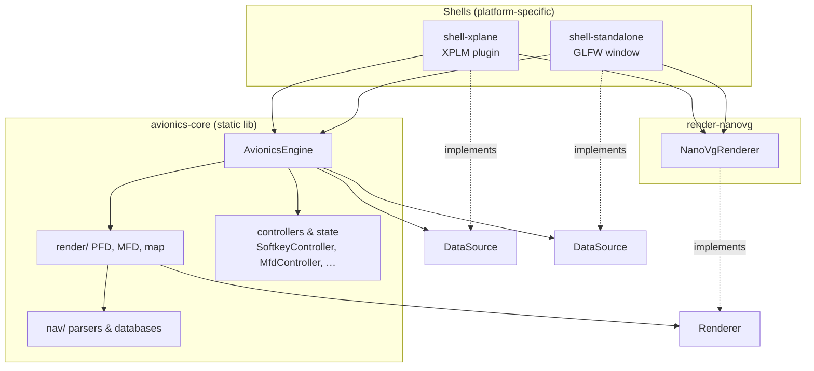
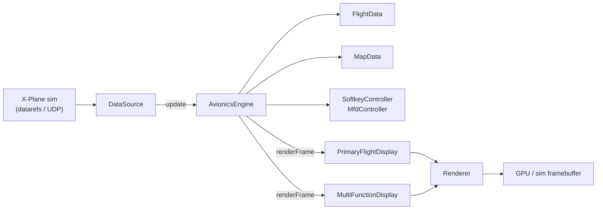

# Architecture

This document is for contributors: where code lives, how modules connect, and
where to start when changing a feature. For building, running, and configuring
the avionics, see [README.md](README.md).

## Design in one sentence

**One platform-independent C++ engine (`avionics-core`) is wired to two thin
shells** — an X-Plane plugin and a standalone desktop app — through two
abstract interfaces: `DataSource` (data in) and `Renderer` (pixels out).

## Module dependency graph



## Per-frame data flow



Each shell owns the frame loop. It constructs one or two `AvionicsEngine`
instances (PFD and/or MFD), calls `update(dt)` then `renderFrame(w, h, pr)` each
tick, and routes physical bezel keys / keyboard input into the engine.

## Top-level layout

| Path | Role |
| ---- | ---- |
| [`avionics-core/`](avionics-core/) | Static library: G1000 behavior, nav-data parsing, vector drawing. No X-Plane or windowing dependencies. |
| [`render-nanovg/`](render-nanovg/) | Shared `Renderer` backend (NanoVG over OpenGL). Used by both shells. |
| [`shell-xplane/`](shell-xplane/) | XPLM plugin: in-process datarefs, sim draw callback, flight-plan and command bridges. |
| [`shell-standalone/`](shell-standalone/) | GLFW app: UDP/Web API link to X-Plane, local nav-data stores, optional off-screen screenshot mode. |
| [`installer/`](installer/) | Platform installers (Windows Inno Setup, macOS, Linux) that stage release assets. |
| [`tools/`](tools/) | Dev utilities: plugin hot-reload, nav-data conversion, PDF reference extraction. |
| [`docs/`](docs/) | Reference PDFs and comparison screenshots (not build docs). |
| [`X-Plane-SDK/`](X-Plane-SDK/) | Vendored X-Plane SDK headers/libs for the plugin shell. |

CMake options (see root [`CMakeLists.txt`](CMakeLists.txt)):

- `BUILD_STANDALONE_SHELL` — default **ON**
- `BUILD_XPLANE_SHELL` — default **OFF** (requires SDK)

## `avionics-core` internals

### Public API (`include/avionics/`)

Headers here are the stable surface the shells and tests include.

| Area | Key headers |
| ---- | ----------- |
| Engine & frame loop | [`AvionicsEngine.h`](avionics-core/include/avionics/AvionicsEngine.h) |
| Data in | [`DataSource.h`](avionics-core/include/avionics/DataSource.h), [`FlightData.h`](avionics-core/include/avionics/FlightData.h), [`MapData.h`](avionics-core/include/avionics/MapData.h) |
| Pixels out | [`Renderer.h`](avionics-core/include/avionics/Renderer.h) |
| UI state | [`SoftkeyController.h`](avionics-core/include/avionics/SoftkeyController.h), [`MfdController.h`](avionics-core/include/avionics/MfdController.h) |
| Instruments (entry points) | [`render/PrimaryFlightDisplay.h`](avionics-core/include/avionics/render/PrimaryFlightDisplay.h), [`render/MultiFunctionDisplay.h`](avionics-core/include/avionics/render/MultiFunctionDisplay.h), [`render/MapView.h`](avionics-core/include/avionics/render/MapView.h) |
| Nav databases | [`NavDatabase.h`](avionics-core/include/avionics/NavDatabase.h), [`CifpParser.h`](avionics-core/include/avionics/CifpParser.h), [`AptDatParser.h`](avionics-core/include/avionics/AptDatParser.h) |

### Source tree (`src/`)

```
avionics-core/src/
  AvionicsEngine.cpp       # boot sequence, VNAV, frame orchestration
  SoftkeyController.cpp    # PFD softkey / popup state machine
  MfdController.cpp        # MFD page groups, map pointer, procedures UI
  NavDatabase.cpp          # earth_nav / earth_fix / earth_awy ingestion
  MockDataSource.cpp       # deterministic offline feed (tests, screenshots)
  nav/                     # parsers & terrain/radar helpers (no drawing)
  render/
    PrimaryFlightDisplay.cpp
    MultiFunctionDisplay.cpp   # under render/mfd/
    BootScreen.cpp, BezelKeys.cpp, SoftkeyBezel.cpp
    pfd/                   # PFD instruments + chrome  → see README there
    map/                   # shared moving map           → see README there
    mfd/                   # MFD pages + EIS strip       → see README there
```

**`src/nav/`** holds file-format parsers and nav-side logic that is not tied to
a particular instrument layout: CIFP procedures, apt.dat geometry, OpenAir
airspace, DSF terrain sampling, NEXRAD tile fetch. Shells populate
`MapData` from local files; the render code only reads `MapData`.

## The two seams

### `DataSource` — data in

Shells implement `avionics::DataSource` and pump it each frame:

| Shell | Implementation | Notes |
| ----- | -------------- | ----- |
| X-Plane plugin | `DatarefDataSource` in [`shell-xplane/src/`](shell-xplane/src/) | Reads `XPLMGetDataf` datarefs in-process; builds `MapData` via plugin nav stores. |
| Standalone | `XPlaneConnection` + stores in [`shell-standalone/src/`](shell-standalone/src/) | UDP RREF / Web API; interpolates between packets; reads nav files from disk (`NavData`, `AptDatStore`, `AirspaceStore`, …). |

`FlightData` carries attitude, speeds, radios, FMA, CDI, etc. `MapData` carries
the flight plan, nearby features, traffic, weather overlays, and map range.
Checklists and EIS layout come through optional `DataSource` overrides.

### `Renderer` — pixels out

All gauge code draws through `avionics::Renderer` (rectangles, paths, text,
clips, transforms). [`render-nanovg/`](render-nanovg/) supplies
`NanoVgRenderer`, bound to whichever OpenGL context the shell owns.

## Render layer pattern

Large instruments are split the same way across PFD, map, and MFD:

1. **Public header** in `include/avionics/render/` — the callable API
   (`PrimaryFlightDisplay::render`, `MapView::render`, …).
2. **Orchestrator `.cpp`** at `render/` or in the subfolder root — computes
   layout, sets clip regions, calls sub-drawers in z-order.
3. **Per-feature translation units** in `render/pfd/`, `render/map/`, or
   `render/mfd/` — one concern per file where practical.
4. **`*Internal.h`** in the subfolder — shared layout constants, `Layout` /
   `Proj` structs, and `draw…` declarations used only inside that instrument
   family. Not installed as public headers.

Deeper file-to-feature maps:

- [PFD render folder](avionics-core/src/render/pfd/README.md)
- [Map render folder](avionics-core/src/render/map/README.md)
- [MFD render folder](avionics-core/src/render/mfd/README.md)

## Where to change things

| You want to… | Start here |
| ------------ | ---------- |
| Add or fix a PFD instrument (ADI, tapes, HSI rose) | [`render/pfd/`](avionics-core/src/render/pfd/) |
| Change PFD chrome (top bar, info panel, popups, softkeys) | [`Chrome*.cpp`](avionics-core/src/render/pfd/), orchestrated from [`Chrome.cpp`](avionics-core/src/render/pfd/Chrome.cpp) |
| Change the moving map (layers, symbols, projection) | [`render/map/`](avionics-core/src/render/map/), entry [`MapView.cpp`](avionics-core/src/render/map/MapView.cpp) |
| Add or fix an MFD page | [`MfdPages.h`](avionics-core/src/render/mfd/MfdPages.h) + matching `Mfd*Page.cpp`; page routing in [`MfdController`](avionics-core/src/render/mfd/MfdController.cpp) |
| Change boot / connection-lost screens | [`BootScreen.cpp`](avionics-core/src/render/BootScreen.cpp), timing in [`AvionicsEngine`](avionics-core/include/avionics/AvionicsEngine.h) |
| Wire a new simulator data field | Add to [`FlightData`](avionics-core/include/avionics/FlightData.h), populate in both `DataSource` implementations, consume in the relevant `draw…` |
| Parse a new nav file format | [`src/nav/`](avionics-core/src/nav/) + shell store that fills `MapData` |
| Change drawing primitives / fonts | [`Renderer.h`](avionics-core/include/avionics/Renderer.h), implement in [`NanoVgRenderer.cpp`](render-nanovg/src/NanoVgRenderer.cpp) |
| Plugin ↔ standalone bridges (FPL, commands) | [`shell-xplane/src/FlightPlanBridge.*`](shell-xplane/src/), [`shell-standalone/src/FlightPlanBridgeClient.*`](shell-standalone/src/) |

## Layout coordinate system

PFD and MFD layouts are authored against the Working Title G1000 NXi **1024×768
GDU canvas** and scaled to the actual framebuffer (`computeLayout` in
[`PfdInternal.h`](avionics-core/src/render/pfd/PfdInternal.h)). Map symbol sizes
use the same 768 px vertical reference so icons stay legible on both the small
PFD inset and the full-screen MFD map (`fontPx` / `kWtCanvasHeight` in
[`MapViewInternal.h`](avionics-core/src/render/map/MapViewInternal.h)).

## Adding a new MFD page (checklist)

1. Add a value to `MfdPage` in [`MfdController.h`](avionics-core/include/avionics/MfdController.h).
2. Register it in the page menu / group navigation
   ([`MfdControllerPageMenu.cpp`](avionics-core/src/render/mfd/MfdControllerPageMenu.cpp)).
3. Declare `draw…Page` in [`MfdPages.h`](avionics-core/src/render/mfd/MfdPages.h) and implement in a new `.cpp`.
4. Add a `case` in [`MultiFunctionDisplay.cpp`](avionics-core/src/render/mfd/MultiFunctionDisplay.cpp) and a title string in `pageTitle`.
5. If the page needs new softkeys, extend `MfdController` state handling.

## Related docs

- [README.md](README.md) — build, run, bezel binding, EIS, NEXRAD, release status
- [docs/reference/](docs/reference/) — Garmin G1000 NXi Pilot's Guide (PDF)
