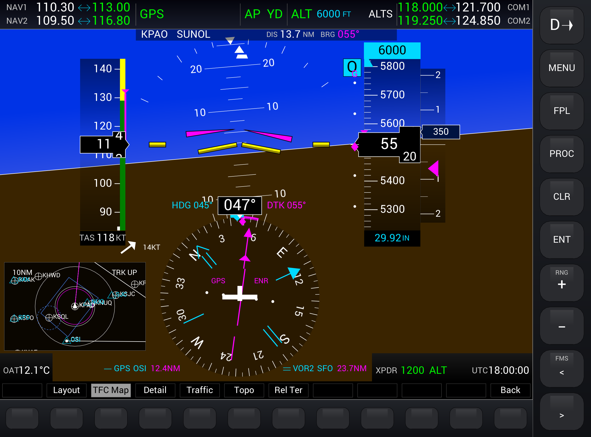
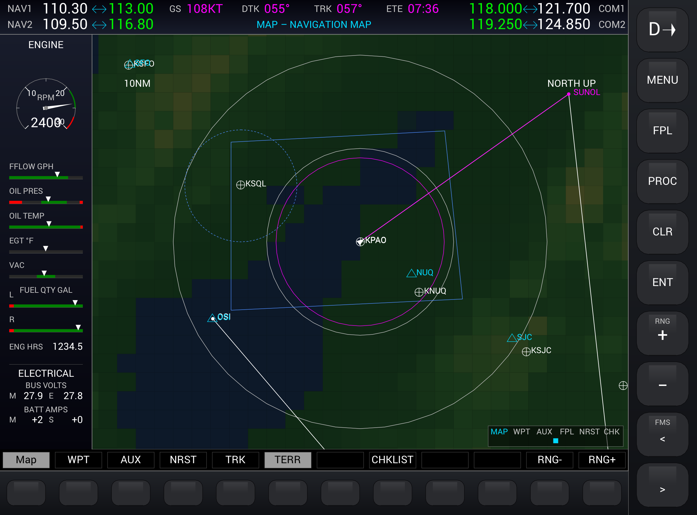

# X-Plane G1000 NXi

A high-performance glass-cockpit (G1000-style PFD/MFD) for X-Plane, built as
**one C++ engine with two shells** so the same avionics code runs:

1. **Natively inside X-Plane** — an XPLM plugin drawn in the sim's render pass.
2. **As a standalone desktop program** — its own window + 60 fps loop, fed by
   X-Plane over the network.





Screenshots from the standalone shell running on the built-in mock feed (PFD with
inset map enabled; MFD on the Navigation Map page).

## Why C++ and this structure

- Native in-cockpit rendering must run inside X-Plane's graphics context and
  frame budget, which rules out a JS/TypeScript engine for that target.
- A 60 fps vector display wants GPU-accelerated drawing (NanoVG over
  GL/Vulkan/Metal).
- ~90% of the work (G1000 behavior + gauge drawing) is platform-independent, so
  it lives once in `avionics-core`; the shells only differ in **where data comes
  from** and **where pixels go**.

```
avionics-core/      C++ static lib: logic + rendering, zero platform deps
  include/avionics/ public headers (DataSource, Renderer, AvionicsEngine, ...)
  src/              engine + sample PrimaryFlightDisplay + MockDataSource
render-nanovg/      shared NanoVG Renderer backend used by both shells
shell-xplane/       XPLM plugin: DatarefDataSource + sim draw callback
shell-standalone/   GLFW window + 60 fps loop; mock or live X-Plane (UDP RREF)
```

The two seams that vary per platform are the abstract interfaces
`avionics::DataSource` (data in) and `avionics::Renderer` (pixels out).

| Concern        | X-Plane shell                          | Standalone shell                                   |
| -------------- | -------------------------------------- | -------------------------------------------------- |
| Frame loop     | Sim calls our draw callback            | We own a 60 fps loop                               |
| Data source    | `XPLMGetDataf` datarefs (in-process)   | X-Plane over UDP (RREF) or built-in mock feed       |
| Renderer       | NanoVG over the sim's GL/Vulkan/Metal  | NanoVG over our GLFW/SDL window                     |

## Build

Default build is the core + standalone shell. GLFW and NanoVG are fetched and
built automatically at configure time (no system packages or external SDKs
needed):

```bash
cmake -S . -B build
cmake --build build
./build/shell-standalone/avionics-standalone   # opens a window rendering the PFD (Esc to quit)
```

By default the standalone shell runs on the built-in mock feed. To connect to a
running X-Plane instance over its UDP data interface, or to switch feeds at
runtime:

```bash
# Start on the live X-Plane connection (default host 127.0.0.1, port 49000):
./build/shell-standalone/avionics-standalone --source xplane
./build/shell-standalone/avionics-standalone --source xplane --xplane-host 192.168.1.50 --xplane-port 49000

# Press M at any time to toggle between MOCK DATA and X-PLANE.
```

The display shows a power-on **boot screen** for a few seconds, then the live
PFD. If no data is arriving (e.g. X-Plane isn't running), it shows a large red
**X** — the same failure annunciation real glass cockpits use when a display
loses its data source.

The connection is written against a generic `SimulatorConnection` interface, so
a future Microsoft Flight Simulator (SimConnect) backend can drop in behind the
same seam without touching the engine or rendering code.

### X-Plane plugin

Requires the [X-Plane SDK](https://developer.x-plane.com/sdk/):

```bash
cmake -S . -B build -DBUILD_XPLANE_SHELL=ON -DXPLANE_SDK_DIR=/path/to/X-Plane-SDK
cmake --build build
```

## Status / next steps

The shared core renders a basic PFD (attitude indicator,
airspeed/altitude/heading readouts) through the abstract renderer, and the
standalone shell now shows it live in a GLFW window via the NanoVG backend,
driven by either `MockDataSource` or a live `XPlaneConnection`.

Still to wire up:

- [x] NanoVG renderer backend implementing `avionics::Renderer` (shared by both
      shells, bound to each shell's GPU context).
- [x] GLFW window + real 60 fps loop in `shell-standalone`.
- [x] Live X-Plane data source for the standalone shell (`XPlaneConnection` over
      the UDP RREF protocol) behind a generic `SimulatorConnection` interface,
      with boot + connection-lost (red X) screens and a mock/live toggle.
- [x] Per-instrument reversionary red X. AHRS failure X's the attitude window
      ("AHRS") and HSI compass ("HDG"); air data computer failure X's the
      airspeed, altitude, and vertical-speed tapes. Driven live from X-Plane's
      `sim/operation/failures/rel_ss_*` datarefs.
- [x] Softkey bar (`SoftkeyController`) driven by a row of twelve physical
      softkey selection keys on the bezel below the screen, like the real GDU
      bezel: the on-screen bar is labels only (white on black, selected keys
      black-on-gray per the Pilot's Guide), and all interaction goes through
      the bezel keys. Pressing "Alerts" toggles the Alerts/messages window,
      which lists active alerts (color-coded by severity) derived from the
      sensor-validity flags.
- [x] Softkey menu state machine: the bar is a menu stack, so the root menu
      opens submenus (Map/HSI, PFD Opt, XPDR), each with a `Back` key that pops
      back up. Display-option keys are toggles that stay highlighted while on,
      and the XPDR submenu is a radio group (STBY/ON/ALT/GND).
- [x] MFD page groups (MAP / WPT / AUX / NRST / FPL) with per-group page
      memory, modeled on the G1000 Pilot's Guide for Cessna Nav III. The
      group softkeys stand in for the large FMS knob (pressing the active
      group's key again steps to its next page, like the small knob), the
      on-screen FMS rocker steps pages directly, and the FPL bezel key
      toggles the Active Flight Plan page. Pages: Navigation Map; Airport /
      Intersection / NDB / VOR Information; Trip Planning, GPS Status,
      System Status; Nearest Airports / Intersections / NDB / VOR /
      Airspaces; Active Flight Plan. A page group/page indicator box sits
      above the softkeys, and navaid frequencies are parsed from
      `earth_nav.dat` for the information pages.
- [x] EIS engine strip on the left edge of every MFD page (Cessna 172S fit):
      RPM dial with green/red arcs, FFLOW / OIL PRES / OIL TEMP / EGT / VAC
      bar indicators, per-tank FUEL QTY, ENG HRS, and the BUS VOLTS / BATT
      AMPS electrical rows — driven live from X-Plane's engine, fuel, and
      electrical datarefs (animated values on the mock feed).
- [x] PFD pop-up windows in the lower right, one at a time like the real unit:
      Timer/References (`Tmr/Ref`) with the generic timer (Start?/Stop?/Reset?
      via ENT, shown as a `TMR` field in the bottom info bar while running),
      V-speed reference bug On/Off toggles honored by the airspeed tape, and
      barometric minimums; Nearest Airports (`Nearest`) listing distance-sorted
      airports with bearing/distance, COM frequency, and longest runway,
      scrolled with the FMS rocker. The FMS rocker moves the References cursor
      (and steps the MINS altitude), ENT activates fields, and CLR closes the
      window, per the Pilot's Guide.
- [x] Altimeter alerting per the NXi Pilot's Guide: barometric minimums (BARO
      MIN box at the bottom left of the altimeter plus a tape bug, staging
      cyan -> white within 100 ft -> amber at minimums) and Selected Altitude
      alerting (the readout flashes black-on-cyan within 1000 ft, cyan within
      200 ft, and amber on a post-capture deviation).
- [x] Transponder functions: `Ident` annunciates a green IDNT in the
      transponder box for 18 seconds (inoperative in Standby, reverts the XPDR
      softkeys to the top level), and the XPDR > Code digit keys show the
      in-progress squawk entry in the data box with BKSP support. Committing
      the completed code to the radio still needs a sim command channel, like
      the VFR and STD Baro keys.
- [ ] Bind the NanoVG renderer inside the plugin via the X-Plane Avionics
      Device API (`XPLMCreateAvionicsEx`), replacing the legacy draw callback.

### G1000 reference

Replicate **behavior and layout** from public Garmin documentation (Pilot's
Guide / Cockpit Reference Guide) and the free G1000 PC Trainer. Do **not** copy
Garmin's bitmaps, fonts, or any decompiled code — reimplement the look with
vector drawing.

## License

This project is licensed under the **GNU General Public License v3.0** — see
the [LICENSE](LICENSE) file for the full text.

> Copyright (C) 2026 Andrew Miller
>
> This program is free software: you can redistribute it and/or modify it under
> the terms of the GNU General Public License as published by the Free Software
> Foundation, either version 3 of the License, or (at your option) any later
> version. This program is distributed in the hope that it will be useful, but
> WITHOUT ANY WARRANTY; without even the implied warranty of MERCHANTABILITY or
> FITNESS FOR A PARTICULAR PURPOSE. See the GNU General Public License for more
> details.

"Garmin" and "G1000" are trademarks of Garmin Ltd. This is an independent,
unofficial reimplementation and is not affiliated with or endorsed by Garmin.
